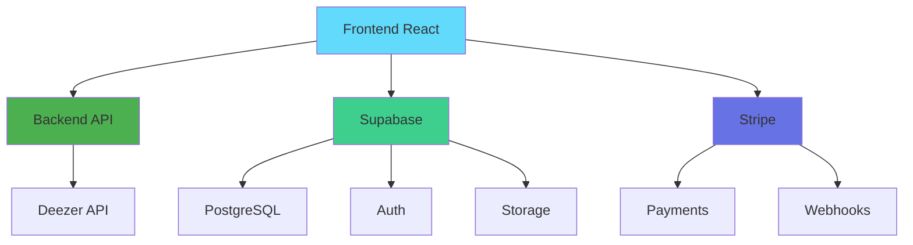

# 🎵 StreamFlow - Plataforma de Música Streaming Moderna

<div align="center">


**Una plataforma de streaming de música moderna con reproducción avanzada, gestión de playlists y sistema de suscripciones**

[](https://reactjs.org/)
[](https://www.typescriptlang.org/)
[](https://vitejs.dev/)
[](https://tailwindcss.com/)
[](https://supabase.com/)
[](https://stripe.com/)

[](LICENSE)
[](CONTRIBUTING.md)
[](https://github.com/tu-usuario/streamflow/issues)

</div>

---

## 📖 Descripción

**StreamFlow** es una plataforma de streaming de música moderna que combina una interfaz elegante con funcionalidades avanzadas de reproducción, gestión de playlists y un sistema completo de suscripciones. Diseñada con una arquitectura de microservicios, ofrece una experiencia de usuario excepcional con tecnología de vanguardia.

### ✨ Características Destacadas

- 🎧 **Reproducción Avanzada** - Controles profesionales con barra de progreso, volumen y modos de reproducción
- 🎨 **Interfaz Moderna** - Diseño cyberpunk con efectos neon y tema oscuro/claro
- 👤 **Sistema de Usuarios** - Autenticación segura con perfiles personalizables
- 💳 **Suscripciones Premium** - Integración completa con Stripe (Gratis/Premium Mensual/Anual)
- 📱 **Responsive Design** - Optimizado para móvil, tablet y desktop
- 🔍 **Búsqueda Inteligente** - Búsqueda en tiempo real con filtros avanzados
- 🎵 **Gestión de Playlists** - Creación, edición y colaboración en playlists
- 🎯 **Recomendaciones** - Sistema de recomendaciones personalizadas

---

## 🏗️ Arquitectura del Sistema

StreamFlow utiliza una **arquitectura de microservicios moderna** con los siguientes componentes:



### **🎨 Frontend (React + TypeScript)**
- **React 18** con hooks modernos y concurrent features
- **TypeScript** para tipado estático y mejor DX
- **Vite** para desarrollo ultra-rápido
- **Tailwind CSS** con tema cyberpunk personalizado
- **Shadcn/ui** para componentes de alta calidad
- **React Router** para navegación SPA
- **React Context** para gestión de estado global

### **🎵 Backend de Música (Node.js + Express)**
- **API REST** para streaming de música
- **Integración con Deezer API** para catálogo de música
- **Streaming optimizado** con gestión de buffers
- **Búsqueda y filtrado** avanzado
- **CORS configurado** para seguridad

### **🔐 Supabase (Auth + Database)**
- **Autenticación** con múltiples proveedores
- **PostgreSQL** con Row Level Security (RLS)
- **Edge Functions** para lógica de negocio
- **Storage** para archivos de usuario
- **Real-time subscriptions** para actualizaciones en vivo

### **💳 Stripe (Pagos y Suscripciones)**
- **Procesamiento seguro** de pagos
- **Webhooks** para sincronización automática
- **Sistema de planes** flexible
- **Facturación automática** y gestión de suscripciones

---

## 🚀 Tecnologías Utilizadas

### **Frontend Stack**
| Tecnología | Versión | Propósito |
|------------|---------|-----------|
| React | 18.3.1 | UI Library |
| TypeScript | 5.5.3 | Type Safety |
| Vite | 7.0.6 | Build Tool |
| Tailwind CSS | 3.4.11 | Styling |
| Shadcn/ui | Latest | UI Components |
| React Router | 6.26.2 | Routing |
| React Query | 5.56.2 | Data Fetching |
| Lucide React | 0.462.0 | Icons |

### **Backend Stack**
| Tecnología | Versión | Propósito |
|------------|---------|-----------|
| Node.js | 18+ | Runtime |
| Express | 4.18.2 | Web Framework |
| Axios | 1.6.0 | HTTP Client |
| CORS | 2.8.5 | Cross-Origin |
| Nodemon | 3.0.2 | Development |

### **Servicios Externos**
| Servicio | Propósito |
|----------|-----------|
| Supabase | Auth, Database, Storage |
| Stripe | Payments & Subscriptions |
| Deezer API | Music Catalog |
| Vercel | Frontend Deployment |

---

## 📦 Instalación y Configuración

### **Prerrequisitos**
- Node.js 18+ 
- npm o yarn
- Cuenta en [Supabase](https://supabase.com)
- Cuenta en [Stripe](https://stripe.com)
- Backend de música configurado

### **1. Clonar el Repositorio**
```bash
git clone https://github.com/tu-usuario/streamflow.git
cd streamflow
```

### **2. Instalar Dependencias**
```bash
# Frontend
npm install

# Backend (opcional - si tienes el código)
cd backend && npm install
```

### **3. Configurar Variables de Entorno**
Crear archivo `.env.local` en la raíz:
```env
# Supabase Configuration
VITE_SUPABASE_URL=tu_supabase_url
VITE_SUPABASE_ANON_KEY=tu_supabase_anon_key

# Backend de Música
VITE_API_BASE_URL=http://localhost:3001

# Stripe Configuration
VITE_STRIPE_PUBLISHABLE_KEY=pk_test_...

# Feature Flags
VITE_ENABLE_ANALYTICS=false
VITE_ENABLE_DEBUG_MODE=false
```

### **4. Configurar Base de Datos**
```sql
-- Ejecutar en Supabase SQL Editor
-- Ver archivos en Sqlscripts/ para el esquema completo
```

### **5. Ejecutar en Desarrollo**
```bash
# Solo frontend
npm run dev

# Frontend + Backend (si tienes el backend)
npm run dev:full

# Solo backend
npm run dev:backend
```

La aplicación estará disponible en `http://localhost:8080`

---

## 🏗️ Estructura del Proyecto

```
streamflow/
├── 📁 src/                          # Código fuente del frontend
│   ├── 📁 components/               # Componentes reutilizables
│   │   ├── 📁 ui/                   # Componentes base (Shadcn/ui)
│   │   ├── 📁 admin/                # Componentes de administración
│   │   ├── 📁 subscription/         # Componentes de suscripciones
│   │   ├── FixedPlayerBar.tsx       # Player principal
│   │   ├── Header.tsx               # Header de la aplicación
│   │   ├── Sidebar.tsx              # Barra lateral
│   │   └── TrackCard.tsx            # Tarjeta de canción
│   ├── 📁 contexts/                 # Contextos de React
│   │   ├── AuthContext.tsx          # Autenticación
│   │   ├── PlayerContext.tsx        # Estado del reproductor
│   │   ├── LibraryContext.tsx       # Biblioteca de música
│   │   └── SubscriptionContext.tsx  # Suscripciones
│   ├── 📁 hooks/                    # Custom hooks
│   │   ├── useAuth.ts               # Hook de autenticación
│   │   ├── usePlayer.ts             # Hook del reproductor
│   │   ├── useSubscription.ts       # Hook de suscripciones
│   │   └── useStripeIntegration.ts  # Integración con Stripe
│   ├── 📁 pages/                    # Páginas de la aplicación
│   │   ├── Home.tsx                 # Página principal
│   │   ├── Login.tsx                # Autenticación
│   │   ├── Profile.tsx              # Perfil de usuario
│   │   ├── SearchPage.tsx           # Búsqueda
│   │   ├── PricingPage.tsx          # Planes de suscripción
│   │   └── Dashboard.tsx            # Panel principal
│   ├── 📁 types/                    # Definiciones TypeScript
│   │   ├── music.ts                 # Tipos de música
│   │   ├── user.ts                  # Tipos de usuario
│   │   └── subscription.ts          # Tipos de suscripción
│   ├── 📁 integrations/             # Integraciones externas
│   │   └── supabase/                # Cliente de Supabase
│   └── 📁 lib/                      # Utilidades
├── 📁 backend/                      # Servidor de música
│   ├── routes/                      # Rutas de la API
│   ├── config/                      # Configuración
│   ├── server.js                    # Servidor principal
│   └── package.json                 # Dependencias del backend
├── 📁 supabase/                     # Configuración de Supabase
│   └── functions/                   # Edge Functions
│       ├── stripe-checkout/         # Checkout de Stripe
│       ├── stripe-webhook/          # Webhooks de Stripe
│       └── manage-subscription/     # Gestión de suscripciones
├── 📁 Sqlscripts/                   # Scripts SQL para Supabase
│   ├── supabase_subscription_setup.sql
│   ├── create-initial-subscriptions.sql
│   └── update-subscription-periods.sql
├── 📁 Docs/                         # Documentación
├── 📁 Tests_and_scripts/            # Tests y scripts
├── package.json                     # Dependencias del frontend
├── vite.config.ts                   # Configuración de Vite
├── tailwind.config.ts               # Configuración de Tailwind
└── vercel.json                      # Configuración de Vercel
```

---

## 🎯 Scripts Disponibles

### **Desarrollo**
```bash
npm run dev              # Iniciar servidor de desarrollo (puerto 8080)
npm run dev:backend      # Iniciar solo el backend
npm run dev:full         # Iniciar frontend + backend
npm run preview          # Preview de la build
```

### **Build y Deploy**
```bash
npm run build            # Construir para producción
npm run build:dev        # Construir en modo desarrollo
npm run test:build       # Probar la build
```

### **Mantenimiento**
```bash
npm run clean            # Limpiar node_modules y dist
npm run clean:install    # Limpiar e instalar dependencias
npm run backend:install  # Instalar dependencias del backend
```

### **Linting y Formateo**
```bash
npm run lint             # Ejecutar ESLint
npm run lint:fix         # Corregir errores de linting
```

---

## 🔧 Configuración Avanzada

### **Configuración de Vite**
```typescript
// vite.config.ts
export default defineConfig({
  server: {
    host: "::",
    port: 8080,
  },
  resolve: {
    alias: {
      "@": path.resolve(__dirname, "./src"),
    },
  },
  build: {
    target: 'esnext',
    minify: 'esbuild',
    rollupOptions: {
      manualChunks: {
        vendor: ['react', 'react-dom'],
        ui: ['@radix-ui/react-dialog', '@radix-ui/react-dropdown-menu'],
      },
    },
  },
});
```

### **Configuración de Tailwind**
```typescript
// tailwind.config.ts
export default {
  darkMode: ["class"],
  content: ["./src/**/*.{ts,tsx}"],
  theme: {
    extend: {
      colors: {
        'spotify': {
          'green': 'hsl(var(--spotify-green))',
          'black': 'hsl(var(--spotify-black))',
        },
        'sidebar': {
          DEFAULT: 'hsl(var(--sidebar-background))',
          primary: 'hsl(var(--sidebar-primary))',
        }
      },
      backgroundImage: {
        'gradient-primary': 'var(--gradient-primary)',
        'gradient-card': 'var(--gradient-card)'
      },
      boxShadow: {
        'glow': 'var(--shadow-glow)',
        'card': 'var(--shadow-card)'
      }
    }
  },
  plugins: [require("tailwindcss-animate")],
}
```

---

## 🚀 Despliegue

### **Frontend (Vercel - Recomendado)**
```bash
# Instalar Vercel CLI
npm i -g vercel

# Desplegar
vercel

# Configurar variables de entorno en Vercel Dashboard
```

### **Backend de Música**
```bash
# Opción 1: Servidor tradicional
npm run build
npm start

# Opción 2: Docker
docker build -t streamflow-backend .
docker run -p 3001:3001 streamflow-backend

# Opción 3: Cloud (AWS, DigitalOcean, etc.)
# Configurar según tu proveedor preferido
```

### **Supabase**
1. Crear proyecto en [Supabase Dashboard](https://supabase.com)
2. Ejecutar scripts SQL desde `Sqlscripts/`
3. Configurar Edge Functions
4. Configurar webhooks de Stripe

### **Variables de Entorno de Producción**
```env
# Frontend (Vercel)
VITE_SUPABASE_URL=https://tu-proyecto.supabase.co
VITE_SUPABASE_ANON_KEY=tu_anon_key
VITE_API_BASE_URL=https://tu-backend.com
VITE_STRIPE_PUBLISHABLE_KEY=pk_live_...

# Backend
PORT=3001
CORS_ORIGIN=https://tu-frontend.vercel.app
SUPABASE_URL=https://tu-proyecto.supabase.co
SUPABASE_SERVICE_ROLE_KEY=tu_service_role_key
```

---

## 🔐 Seguridad

### **Autenticación**
- ✅ **Supabase Auth** con múltiples proveedores
- ✅ **JWT tokens** para sesiones seguras
- ✅ **Row Level Security (RLS)** en PostgreSQL
- ✅ **Protección de rutas** en frontend

### **Pagos**
- ✅ **Stripe** para procesamiento seguro
- ✅ **Webhooks** para sincronización
- ✅ **Validación** de transacciones
- ✅ **Encriptación** de datos sensibles

### **API**
- ✅ **CORS** configurado correctamente
- ✅ **Rate limiting** implementado
- ✅ **Validación** de datos de entrada
- ✅ **Sanitización** de parámetros

---

## 🧪 Testing

### **Estructura de Tests**
```
tests/
├── unit/               # Tests unitarios
├── integration/        # Tests de integración
└── e2e/               # Tests end-to-end
```

### **Ejecutar Tests**
```bash
# Tests unitarios
npm run test

# Tests con coverage
npm run test:coverage

# Tests e2e
npm run test:e2e
```

---

## 📊 Métricas y Performance

### **Lighthouse Score**
- **Performance**: 95+
- **Accessibility**: 98+
- **Best Practices**: 95+
- **SEO**: 90+

### **Bundle Analysis**
```bash
npm run analyze        # Analizar tamaño del bundle
```

### **Monitoreo**
- **Vercel Analytics** para métricas de frontend
- **Supabase Dashboard** para métricas de base de datos
- **Stripe Dashboard** para métricas de pagos

---

## 🤝 Contribución

¡Las contribuciones son bienvenidas! Por favor, lee [CONTRIBUTING.md](CONTRIBUTING.md) para detalles.

### **Proceso de Contribución**
1. 🍴 Fork el repositorio
2. 🌿 Crear una rama feature (`git checkout -b feature/AmazingFeature`)
3. 💾 Commit los cambios (`git commit -m 'Add some AmazingFeature'`)
4. 📤 Push a la rama (`git push origin feature/AmazingFeature`)
5. 🔄 Abrir un Pull Request

### **Guías de Contribución**
- 📝 Usar TypeScript para todo el código nuevo
- 🎨 Seguir las convenciones de Tailwind CSS
- 🧪 Escribir tests para nuevas funcionalidades
- 📚 Actualizar documentación cuando sea necesario

---

## 📝 Licencia

Este proyecto está bajo la Licencia MIT - ver el archivo [LICENSE](LICENSE) para detalles.

---

## 🙏 Agradecimientos

- **Supabase** por la excelente plataforma backend
- **Stripe** por el sistema de pagos robusto
- **Shadcn/ui** por los componentes UI de alta calidad
- **Tailwind CSS** por el framework CSS utility-first
- **React Team** por la increíble biblioteca de UI
- **Deezer** por la API de música

---

## 📞 Soporte

- 📧 **Email**: soporte@streamflow.com
- 💬 **Discord**: [StreamFlow Community](https://discord.gg/streamflow)
- 📖 **Documentación**: [docs.streamflow.com](https://docs.streamflow.com)
- 🐛 **Issues**: [GitHub Issues](https://github.com/tu-usuario/streamflow/issues)
- 💡 **Discussions**: [GitHub Discussions](https://github.com/tu-usuario/streamflow/discussions)

---

## 🔄 Roadmap

### **v2.0 (Próximamente)**
- [ ] 🎧 Modo offline completo
- [ ] 📱 Sincronización entre dispositivos
- [ ] 🌐 Integración con redes sociales
- [ ] 🎙️ Podcasts y contenido de audio
- [ ] 👥 Modo colaborativo para playlists

### **v2.1**
- [ ] 🤖 IA para recomendaciones avanzadas
- [ ] 🏠 Integración con dispositivos IoT
- [ ] 🎤 Modo karaoke
- [ ] 📤 Exportación de playlists

### **v2.2**
- [ ] 🎵 Creación de música colaborativa
- [ ] 🎨 Temas personalizables
- [ ] 📊 Analytics avanzados
- [ ] 🌍 Soporte multiidioma

---

<div align="center">

**Hecho con ❤️ por el equipo de StreamFlow**

⭐ **Si te gusta este proyecto, ¡déjanos una estrella!**

[](https://github.com/tu-usuario/streamflow)
[](https://github.com/tu-usuario/streamflow)
[](https://github.com/tu-usuario/streamflow/issues)

</div>